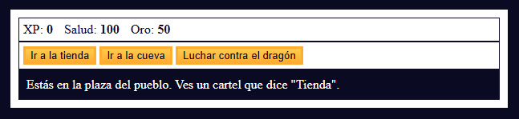

# 🐉 Dragon Repeller RPG

Un mini juego RPG por turnos desarrollado con **HTML, CSS y JavaScript** como parte de mi formación en el curso **JavaScript Algorithms and Data Structures** impartido por [freeCodeCamp](https://www.freecodecamp.org/).

---

## 🎮 Descripción

**Dragon Repeller** es un juego de texto interactivo en el que debes recorrer diferentes lugares, luchar contra monstruos y mejorar tu inventario hasta derrotar al **dragón final** que aterroriza la ciudad.  

El jugador puede:  
- ⚔ Ganar **oro** y **experiencia (XP)** al derrotar enemigos.  
- 🛒 Comprar **armas** y **salud** en la tienda.  
- 🕳️ Luchar contra monstruos en la **cueva**.  
- 🐉 Enfrentarse al **dragón** para ganar la partida.  
- 🎲 Descubrir un **easter egg secreto**.  

---

## 🚀 Tecnologías utilizadas

- **HTML5** → estructura del juego  
- **CSS3** → estilos y diseño  
- **JavaScript (ES6+)** → lógica del juego, sistema de combate, inventario y progresión  

---

## 📂 Estructura del proyecto

```bash
📁 dragon-repeller
 ┣ 📜 index.html   # Estructura principal del juego
 ┣ 📜 styles.css   # Estilos y diseño
 ┗ 📜 script.js    # Lógica del juego
```

----

## 🕹️ Cómo jugar

1. Clona este repositorio:
```bash
git clone https://github.com/bustosjean/role_playing_game.git
```
1. Abre el archivo index.html en tu navegador.

1. Usa los botones para explorar, luchar y progresar en la aventura.

---

## 📸 Vista previa



## 🎯 Objetivo de aprendizaje

- Este proyecto me permitió aplicar:

- Manipulación del DOM con JavaScript.

- Uso de event listeners en botones.

- Manejo de arrays, objetos y funciones.

- Control de estados y flujo del juego.

## 🏆 Estado del proyecto

✅ Completado como parte del curso de freeCodeCamp.

🔜 Futuras mejoras: añadir imágenes de personajes, música y animaciones.

👨‍💻 Desarrollado por [Jean Bustos](https://github.com/bustosjean).

📚 Parte de mi formación en freeCodeCamp - JavaScript Algorithms and Data Structures.
